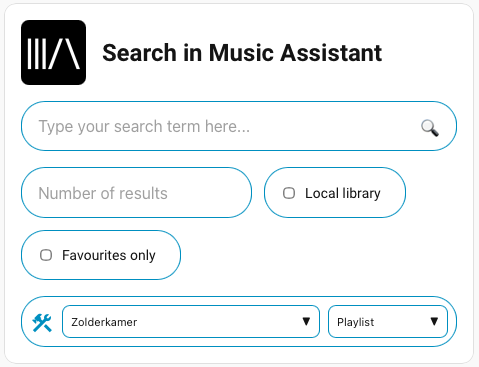

# Mass Search Card

The **Mass Search Card** is a custom Lovelace card for Home Assistant that lets you search and play music directly from [Music Assistant](https://music-assistant.io). Search for artists, tracks, albums, playlists, and radio stations, and play them instantly on any Music Assistant media player.

## Features

- Search for **artists, tracks, albums, playlists** and **radio stations**
- Plays directly on any Music Assistant media player
- Filter results by **local library** or **favourites only**
- Configurable number of search results
- **Default player and media type** — remembered automatically, or pinned via config
- Visual **card editor** in the HA card browser (no YAML required)
- **card-mod** compatible
- Multi-language support: 🇬🇧 English, 🇳🇱 Dutch, 🇨🇿 Czech, 🇸🇪 Swedish, 🇸🇰 Slovak, 🇫🇷 French
- Responsive layout — works on mobile and desktop

## Screenshots

| Search card | Search results |
|:-----------:|:--------------:|
|  | _coming soon_ |

## Installation

### HACS (recommended)

1. Make sure [HACS](https://hacs.xyz) is installed.
2. Add this repository as a custom repository in HACS:
   - Go to **HACS → Frontend** and click the three-dot menu → **Custom repositories**
   - Add `https://github.com/fastxl2024/mass-search-card` as category **Dashboard**
3. Search for **Mass Search Card** and install it.
4. Add the resource to your Lovelace configuration:
   ```yaml
   resources:
     - url: /hacsfiles/mass-search-card/mass-search-card.js
       type: module
   ```

### Manual installation

1. Download `mass-search-card.js` from this repository.
2. Place the file in the `/www` folder of your Home Assistant configuration directory.
3. Add the resource to your Lovelace configuration:
   ```yaml
   resources:
     - url: /local/mass-search-card.js
       type: module
   ```

## Usage

Add the card to your dashboard via the card browser, or add it manually in YAML:

```yaml
type: custom:mass-search-card
language: en
```

### Visual editor

The card supports the built-in HA card editor. Click the pencil icon in the card browser to configure the card without editing YAML.

## Configuration

All options are optional.

| Option | Type | Default | Description |
|--------|------|---------|-------------|
| `language` | string | `en` | Interface language. Supported values: `en`, `nl`, `cz`, `sv`, `sk`, `fr` |
| `default_player` | string | — | Pin a default Music Assistant media player (entity_id). Overrides the last-used player. |
| `default_media_type` | string | — | Pin a default media type. One of: `track`, `album`, `artist`, `playlist`, `radio`. Overrides the last-used type. |

The last used player and media type are automatically saved and restored across page reloads. Use `default_player` and `default_media_type` to lock a fixed selection.

**Example with defaults:**
```yaml
type: custom:mass-search-card
language: nl
default_player: media_player.living_room
default_media_type: track
```

## Languages

Feel free to contribute additional languages! The translation keys are defined at the top of `mass-search-card.js`.

Currently supported: English (`en`), Dutch (`nl`), Czech (`cz`), Swedish (`sv`), Slovak (`sk`), French (`fr`).

## Known issues

- No artwork icon shown when an item is already in the local library
